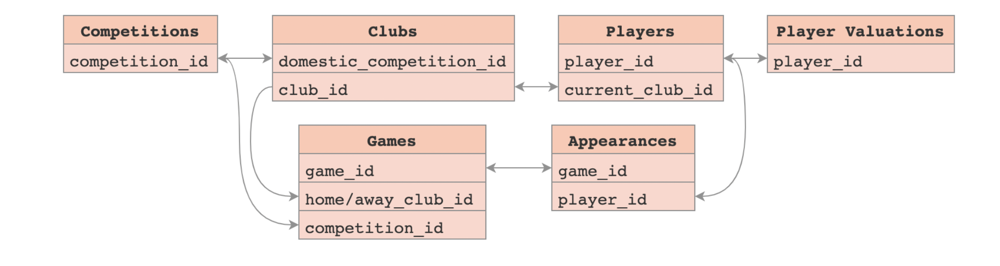

# Football-Data-from-Transfermarkt

Data on European football clubs' player transfers, as found on [Transfermarkt](https://www.transfermarkt.com/), since the 1992/93 season.

The dataset is composed of multiple CSV files with information on competitions, games, clubs, players and appearances that is automatically updated once a week. For this project we have used data that has been uploaded till 11/21/2022

### Basic Information

* **Model date**: November 11, 2022
* **Model version**: 1.0

| Header | Description | Data Type |
| --- | --- | --- |
| `club_name` | name of club | text |
| `player_name` | name of player | text |
| `position` | position of player | text |
| `goals` | number of goals scored | int |
| `assists` | number of assists | int |
| `yellow cards` | number of yellow cards received | int |
| `red cards` | number of red cards received | int |
| `minutes played` | number of minutes played by player | int |

 

